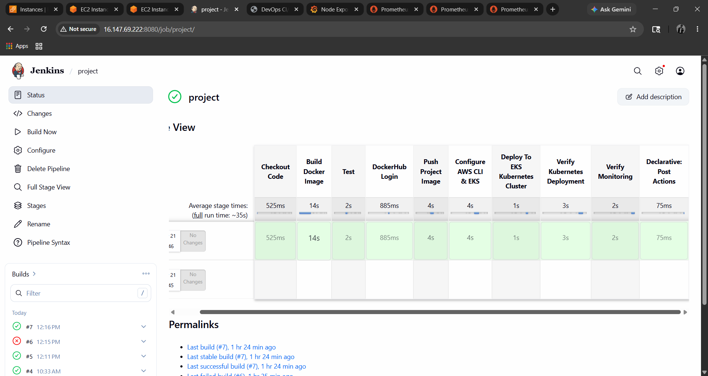
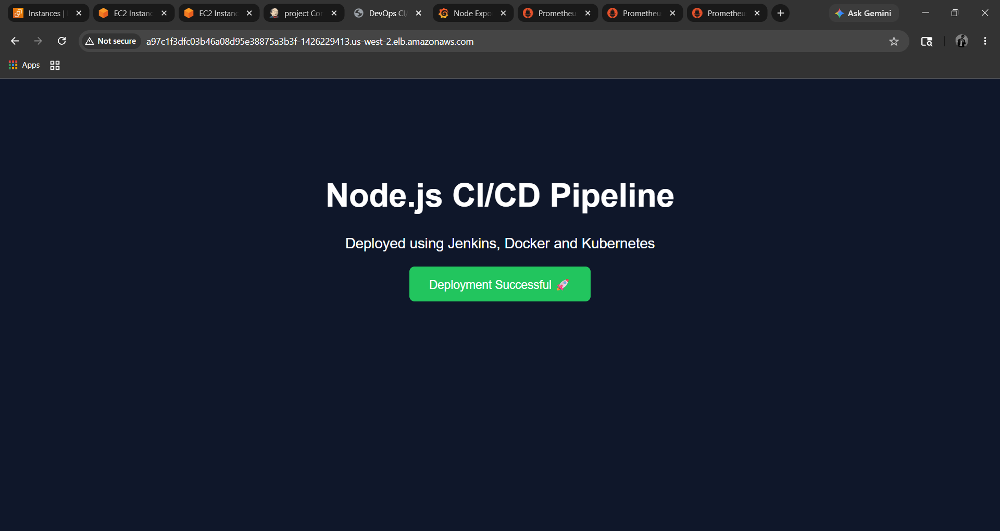
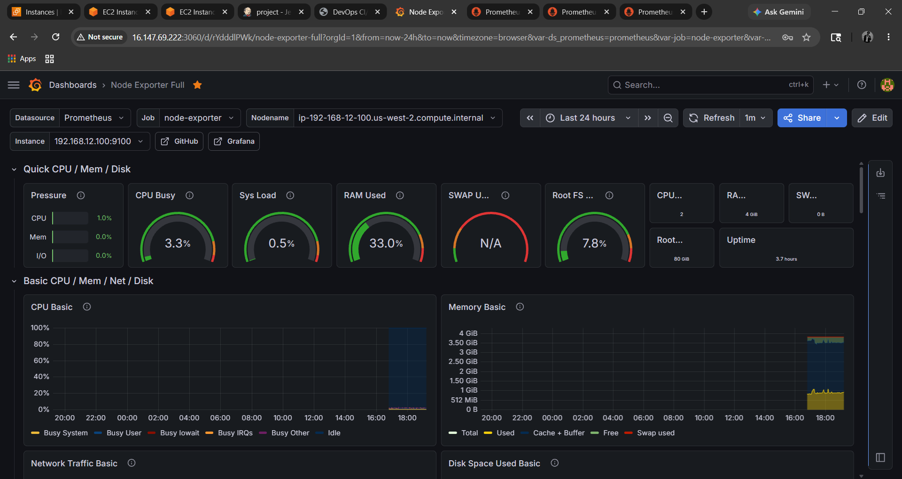
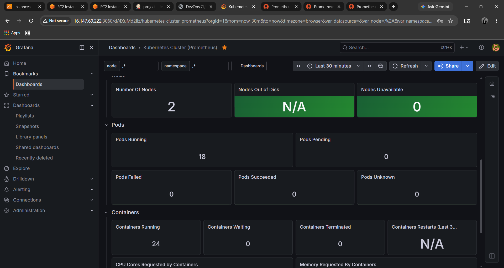
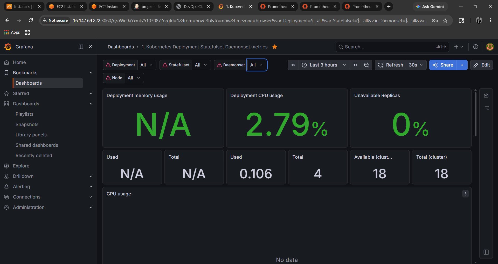
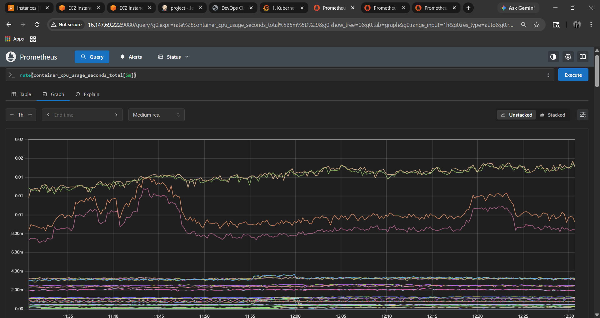
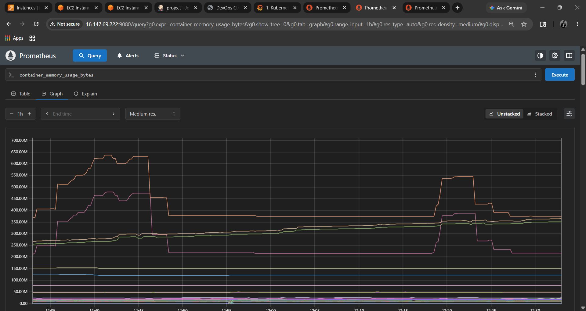
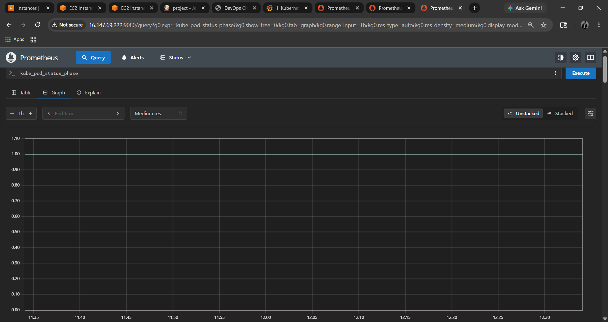

---

````md
# 🚀 Node.js Static Website Deployment using Jenkins CI/CD and Kubernetes

This project demonstrates a complete DevOps pipeline to deploy a **static Node.js web application** using:

- Node.js
- Express.js
- Docker
- Jenkins CI/CD
- Kubernetes (EKS)
- DockerHub

The pipeline automates build, test, containerization, and deployment to a Kubernetes cluster.

---

## ☁️ AWS EC2 Setup (Prerequisites)

Create an EC2 instance:

- Instance Type: `t2.medium`
- OS: Ubuntu 24.04
- Storage: 15 GB GP3

### 🔐 Security Group Rules

Allow inbound traffic:

| Port  | Purpose |
|------|--------|
| 80   | HTTP |
| 443  | HTTPS |
| 3000 | Node.js App |
| 8080 | Jenkins |
| 9090 | Prometheus |
| All Traffic | For testing (temporary) |

---

## 🛠️ Tech Stack

| Technology | Purpose |
|-----------|--------|
| Node.js | Backend runtime |
| Express.js | Web framework |
| Docker | Containerization |
| Jenkins | CI/CD automation |
| Kubernetes | Container orchestration |
| DockerHub | Image registry |
| AWS EKS | Managed Kubernetes cluster |

---

## 📁 Project Structure

```bash
.
├── public/
│   ├── index.html
│   └── style.css
├── deployment.yaml
├── app.js
├── package.json
├── Dockerfile
├── Jenkinsfile
└── README.md
````

---

## 🚀 Step 1: Clone Repository

```bash
git clone https://github.com/youngbuddah/project123.git
cd project123
```

---

## 📦 Step 2: Install Dependencies

```bash
sudo apt update -y
sudo apt install -y nodejs npm docker.io

node -v
npm -v
```

---

## ▶️ Step 3: Run Application Locally

```bash
node app.js
```

Access in browser:

```
http://<public-ip>:3000
```

---

## 🐳 Step 4: Build Docker Image

```bash
docker build -t <dockerhub-username>/project .
```

---

## ▶️ Step 5: Run Docker Container

```bash
docker run -d -p 3000:3000 <dockerhub-username>/project
```

---

## ☁️ Step 6: Push Image to DockerHub

```bash
docker login
docker push <dockerhub-username>/project:latest
```

---

## ⚙️ Step 7: Install AWS CLI, kubectl & eksctl

Use the automation script below:

```bash
#!/bin/bash
set -e

echo "Installing eksctl..."
curl --silent --location "https://github.com/weaveworks/eksctl/releases/latest/download/eksctl_$(uname -s)_amd64.tar.gz" | tar xz -C /tmp
sudo mv /tmp/eksctl /usr/local/bin

echo "Installing kubectl..."
curl -LO "https://dl.k8s.io/release/$(curl -Ls https://dl.k8s.io/release/stable.txt)/bin/linux/amd64/kubectl"
sudo install -o root -g root -m 0755 kubectl /usr/local/bin/kubectl

echo "Installing AWS CLI..."
sudo apt install unzip -y
curl "https://awscli.amazonaws.com/awscli-exe-linux-x86_64.zip" -o "awscliv2.zip"
unzip -q awscliv2.zip
sudo ./aws/install

echo "Configuring AWS CLI..."
aws configure

echo "Creating EKS cluster..."
eksctl create cluster \
  --name cluster123 \
  --region us-east-1 \
  --version 1.32 \
  --nodegroup-name ng1 \
  --node-type t2.medium \
  --nodes 2
```

⏳ Cluster creation may take **20–30 minutes**

---

## 🔗 Configure kubectl with EKS

```bash
aws eks update-kubeconfig --region us-east-1 --name cluster123
```

---

## ☸️ Step 8: Deploy to Kubernetes

```bash
kubectl apply -f deployment.yaml
```

---

## 📊 Verify Deployment

```bash
kubectl get pods
kubectl get svc
```

---

## 🔁 Jenkins CI/CD Pipeline

The Jenkins pipeline automates:

* Git Checkout
* Install dependencies
* Build Docker image
* Run tests (Mocha)
* Push image to DockerHub
* Deploy to Kubernetes

---

## 🔧 Jenkins Setup

### Required Plugins:

* Docker Pipeline
* Kubernetes CLI
* Git

### Credentials:

* DockerHub credentials
* Kubernetes kubeconfig

---

## 🐳 Dockerfile

```dockerfile
FROM node:18

WORKDIR /app

COPY package*.json ./

RUN npm install

COPY . .

EXPOSE 3000

CMD ["node", "app.js"]
```

---

## 📈 Enhancements Added

* Helm Charts
* Prometheus Monitoring
* Grafana Dashboards

---

## 👨‍💻 Author

**Abhay Bendekar**

## Static Website WebPage


## Jenkins Pipeline


## Grafana Dashboard




## Prometheus Dashboard



